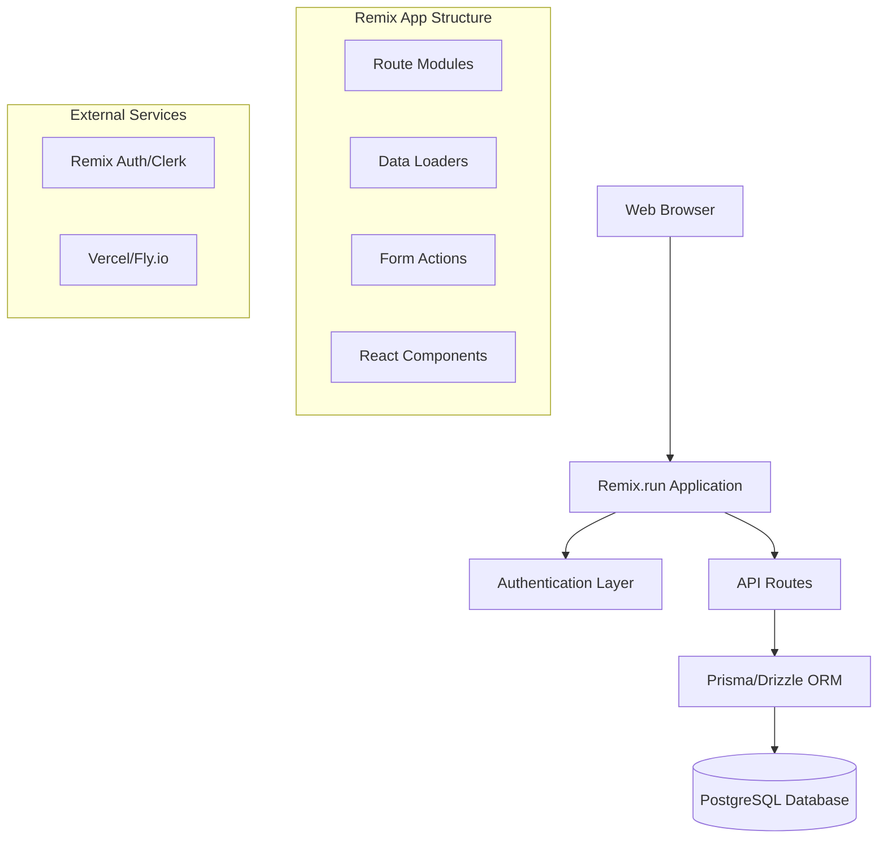

# Design Document

## Overview

The ISP Management System is a full-stack web application built with Remix.run that provides comprehensive management capabilities for ISP companies. The system integrates customer management, service packages, ticketing, and human resources into a unified platform with role-based access control and real-time dashboards.

The application follows Remix.run's nested routing architecture and leverages server-side rendering for optimal performance. The design emphasizes data consistency, user experience, and scalability while maintaining security through proper authentication and authorization mechanisms.

## Architecture

### High-Level Architecture



### Technology Stack

- **Frontend**: Remix.run with React 18, TypeScript
- **Styling**: Tailwind CSS with shadcn/ui components
- **Backend**: Remix.run server-side functions (loaders/actions)
- **Database**: PostgreSQL with Prisma ORM
- **Authentication**: Remix Auth or Clerk
- **Deployment**: Vercel or Fly.io
- **State Management**: Remix's built-in data loading and form handling

### Folder Structure

```
app/
├── routes/
│   ├── _index.tsx                 # Dashboard
│   ├── customers/
│   │   ├── _index.tsx            # Customer list
│   │   ├── new.tsx               # Add customer
│   │   └── $id.tsx               # Customer details
│   ├── packages/
│   │   ├── _index.tsx            # Package management
│   │   ├── new.tsx               # Create package
│   │   └── $id.tsx               # Edit package
│   ├── tickets/
│   │   ├── _index.tsx            # Ticket list
│   │   ├── new.tsx               # Create ticket
│   │   └── $id.tsx               # Ticket details
│   ├── employees/
│   │   ├── _index.tsx            # Employee list
│   │   ├── new.tsx               # Add employee
│   │   └── $id.tsx               # Employee profile
│   ├── reports/
│   │   └── _index.tsx            # Reports dashboard
│   └── auth/
│       ├── login.tsx
│       └── logout.tsx
├── components/
│   ├── ui/                       # shadcn/ui components
│   ├── forms/                    # Form components
│   ├── tables/                   # Data table components
│   └── charts/                   # Dashboard charts
├── lib/
│   ├── db.server.ts              # Database connection
│   ├── auth.server.ts            # Authentication utilities
│   ├── permissions.server.ts     # Role-based access control
│   └── utils.ts                  # Utility functions
└── styles/
    └── tailwind.css
```

## Components and Interfaces

### Core Data Models

#### Customer Model
```typescript
interface Customer {
  id: string
  name: string
  email: string
  phone: string
  address: string
  location: string
  status: 'active' | 'inactive' | 'suspended'
  packageId: string
  createdAt: Date
  updatedAt: Date
  payments: Payment[]
  tickets: Ticket[]
}
```

#### Package Model
```typescript
interface Package {
  id: string
  name: string
  speed: string
  price: number
  duration: 'monthly' | 'yearly'
  description?: string
  isActive: boolean
  createdAt: Date
  updatedAt: Date
  customers: Customer[]
}
```

#### Ticket Model
```typescript
interface Ticket {
  id: string
  title: string
  description: string
  status: 'open' | 'in_progress' | 'pending' | 'resolved' | 'closed'
  priority: 'low' | 'medium' | 'high' | 'urgent'
  category: 'network_issues' | 'equipment_damage' | 'installation' | 'others'
  customerId: string
  assignedToId?: string
  createdAt: Date
  completedAt?: Date
  notes: TicketNote[]
  statusHistory: TicketStatusHistory[]
  feedback?: TicketFeedback
  customer: Customer
  assignedTo?: Employee
}

interface TicketNote {
  id: string
  ticketId: string
  employeeId: string
  note: string
  createdAt: Date
  employee: Employee
}

interface TicketStatusHistory {
  id: string
  ticketId: string
  fromStatus: string
  toStatus: string
  changedBy: string
  changedAt: Date
  reason?: string
  employee: Employee
}

interface TicketFeedback {
  id: string
  ticketId: string
  customerId: string
  rating: number // 1-5 scale
  comment?: string
  createdAt: Date
}
```

#### Employee Model
```typescript
interface Employee {
  id: string
  name: string
  email: string
  phone: string
  position: string
  division: string
  role: 'admin' | 'technician' | 'marketing' | 'hr'
  hireDate: Date
  photo?: string
  isActive: boolean
  canHandleTickets: boolean
  handlingStatus: 'available' | 'busy' | 'offline'
  maxConcurrentTickets: number
  currentTicketCount: number
  assignedTickets: Ticket[]
  completedTickets: Ticket[]
  performanceMetrics: EmployeePerformance
}

interface EmployeePerformance {
  totalTicketsResolved: number
  averageResolutionTime: number // in hours
  customerRating: number // average rating
  ticketsResolvedThisMonth: number
  lastUpdated: Date
}
```

### Key Components

#### Navigation Component
- Role-based menu rendering
- Active route highlighting
- User profile dropdown

#### Data Tables
- Sortable columns
- Filtering capabilities
- Pagination
- Bulk actions

#### Forms
- Validation using Zod schemas
- Error handling and display
- Progressive enhancement
- File upload for employee photos

#### Dashboard Widgets
- Customer statistics cards
- Ticket status overview
- Performance charts
- Recent activity feed

## Data Models

### Database Schema Design

```sql
-- Users table for authentication
CREATE TABLE users (
  id UUID PRIMARY KEY DEFAULT gen_random_uuid(),
  email VARCHAR(255) UNIQUE NOT NULL,
  password_hash VARCHAR(255),
  created_at TIMESTAMP DEFAULT NOW(),
  updated_at TIMESTAMP DEFAULT NOW()
);

-- Employees table
CREATE TABLE employees (
  id UUID PRIMARY KEY DEFAULT gen_random_uuid(),
  user_id UUID REFERENCES users(id),
  name VARCHAR(255) NOT NULL,
  phone VARCHAR(50),
  position VARCHAR(100),
  division VARCHAR(100),
  role VARCHAR(20) CHECK (role IN ('admin', 'technician', 'marketing', 'hr')),
  hire_date DATE,
  photo_url VARCHAR(500),
  is_active BOOLEAN DEFAULT true,
  can_handle_tickets BOOLEAN DEFAULT false,
  handling_status VARCHAR(20) CHECK (handling_status IN ('available', 'busy', 'offline')) DEFAULT 'available',
  max_concurrent_tickets INTEGER DEFAULT 5,
  current_ticket_count INTEGER DEFAULT 0,
  created_at TIMESTAMP DEFAULT NOW(),
  updated_at TIMESTAMP DEFAULT NOW()
);

-- Packages table
CREATE TABLE packages (
  id UUID PRIMARY KEY DEFAULT gen_random_uuid(),
  name VARCHAR(255) NOT NULL,
  speed VARCHAR(50) NOT NULL,
  price DECIMAL(10,2) NOT NULL,
  duration VARCHAR(20) CHECK (duration IN ('monthly', 'yearly')),
  description TEXT,
  is_active BOOLEAN DEFAULT true,
  created_at TIMESTAMP DEFAULT NOW(),
  updated_at TIMESTAMP DEFAULT NOW()
);

-- Customers table
CREATE TABLE customers (
  id UUID PRIMARY KEY DEFAULT gen_random_uuid(),
  name VARCHAR(255) NOT NULL,
  email VARCHAR(255),
  phone VARCHAR(50),
  address TEXT,
  location VARCHAR(255),
  status VARCHAR(20) CHECK (status IN ('active', 'inactive', 'suspended')),
  package_id UUID REFERENCES packages(id),
  created_at TIMESTAMP DEFAULT NOW(),
  updated_at TIMESTAMP DEFAULT NOW()
);

-- Tickets table
CREATE TABLE tickets (
  id UUID PRIMARY KEY DEFAULT gen_random_uuid(),
  title VARCHAR(255) NOT NULL,
  description TEXT NOT NULL,
  status VARCHAR(20) CHECK (status IN ('open', 'in_progress', 'pending', 'resolved', 'closed')),
  priority VARCHAR(20) CHECK (priority IN ('low', 'medium', 'high', 'urgent')),
  category VARCHAR(50) CHECK (category IN ('network_issues', 'equipment_damage', 'installation', 'others')),
  customer_id UUID REFERENCES customers(id),
  assigned_to_id UUID REFERENCES employees(id),
  created_at TIMESTAMP DEFAULT NOW(),
  completed_at TIMESTAMP,
  updated_at TIMESTAMP DEFAULT NOW()
);

-- Ticket notes table
CREATE TABLE ticket_notes (
  id UUID PRIMARY KEY DEFAULT gen_random_uuid(),
  ticket_id UUID REFERENCES tickets(id),
  employee_id UUID REFERENCES employees(id),
  note TEXT NOT NULL,
  created_at TIMESTAMP DEFAULT NOW()
);

-- Payments table
CREATE TABLE payments (
  id UUID PRIMARY KEY DEFAULT gen_random_uuid(),
  customer_id UUID REFERENCES customers(id),
  amount DECIMAL(10,2) NOT NULL,
  payment_date DATE NOT NULL,
  status VARCHAR(20) CHECK (status IN ('paid', 'pending', 'overdue')),
  created_at TIMESTAMP DEFAULT NOW()
);

-- Ticket status history table
CREATE TABLE ticket_status_history (
  id UUID PRIMARY KEY DEFAULT gen_random_uuid(),
  ticket_id UUID REFERENCES tickets(id),
  from_status VARCHAR(20),
  to_status VARCHAR(20) NOT NULL,
  changed_by UUID REFERENCES employees(id),
  changed_at TIMESTAMP DEFAULT NOW(),
  reason TEXT
);

-- Ticket feedback table
CREATE TABLE ticket_feedback (
  id UUID PRIMARY KEY DEFAULT gen_random_uuid(),
  ticket_id UUID REFERENCES tickets(id),
  customer_id UUID REFERENCES customers(id),
  rating INTEGER CHECK (rating >= 1 AND rating <= 5),
  comment TEXT,
  created_at TIMESTAMP DEFAULT NOW()
);

-- Employee performance metrics table
CREATE TABLE employee_performance (
  id UUID PRIMARY KEY DEFAULT gen_random_uuid(),
  employee_id UUID REFERENCES employees(id),
  total_tickets_resolved INTEGER DEFAULT 0,
  average_resolution_time DECIMAL(5,2) DEFAULT 0, -- in hours
  customer_rating DECIMAL(3,2) DEFAULT 0, -- average rating
  tickets_resolved_this_month INTEGER DEFAULT 0,
  last_updated TIMESTAMP DEFAULT NOW(),
  UNIQUE(employee_id)
);
```

### Relationships
- One-to-Many: Package → Customers
- One-to-Many: Customer → Tickets, Payments
- One-to-Many: Employee → Assigned Tickets
- One-to-Many: Ticket → Ticket Notes
- One-to-One: Employee → User (for authentication)

## Error Handling

### Client-Side Error Handling
- Form validation errors displayed inline
- Network error notifications
- Graceful fallbacks for failed data loads
- Error boundaries for component crashes

### Server-Side Error Handling
- Structured error responses from loaders/actions
- Database constraint violation handling
- Authentication/authorization error handling
- Logging for debugging and monitoring

### Error Response Format
```typescript
interface ErrorResponse {
  message: string
  field?: string
  code: string
  details?: Record<string, any>
}
```

## Testing Strategy

### Unit Testing
- Component testing with React Testing Library
- Utility function testing with Jest
- Database model validation testing
- Form validation schema testing

### Integration Testing
- Route testing with Remix testing utilities
- Database integration testing
- Authentication flow testing
- API endpoint testing

### End-to-End Testing
- Critical user journeys (login, create ticket, assign technician)
- Role-based access control verification
- Form submission and data persistence
- Dashboard functionality

### Testing Tools
- Jest for unit tests
- React Testing Library for component tests
- Playwright or Cypress for E2E tests
- MSW for API mocking

### Test Coverage Goals
- Minimum 80% code coverage for business logic
- 100% coverage for critical security functions
- All user-facing forms and workflows tested
- Database operations and data integrity tested

## Security Considerations

### Authentication & Authorization
- Secure session management with Remix Auth
- Role-based access control middleware
- Protected routes based on user permissions
- Secure password hashing and storage

### Data Protection
- Input validation and sanitization
- SQL injection prevention through ORM
- XSS protection through proper escaping
- CSRF protection via Remix's built-in mechanisms

### API Security
- Rate limiting on sensitive endpoints
- Request validation using Zod schemas
- Proper error messages without information leakage
- Audit logging for sensitive operations

## Role-Based Access Control

### Permission Matrix

| Feature | Admin | Technician | Marketing | HR |
|---------|-------|------------|-----------|-----|
| View Dashboard | ✓ | ✓ | ✓ | ✓ |
| Manage Customers | ✓ | View Only | ✓ | View Only |
| Create/Edit Packages | ✓ | ✗ | ✓ | ✗ |
| View All Tickets | ✓ | ✓ | View Only | ✗ |
| Assign Tickets | ✓ | ✗ | ✗ | ✗ |
| Update Ticket Status | ✓ | Own Tickets | ✗ | ✗ |
| Manage Employees | ✓ | ✗ | ✗ | ✓ |
| View Reports | ✓ | Limited | ✓ | ✓ |
| System Settings | ✓ | ✗ | ✗ | ✗ |

### Permission Implementation
```typescript
interface Permission {
  resource: string
  action: 'create' | 'read' | 'update' | 'delete'
  conditions?: Record<string, any>
}

const rolePermissions: Record<string, Permission[]> = {
  admin: [
    { resource: '*', action: 'create' },
    { resource: '*', action: 'read' },
    { resource: '*', action: 'update' },
    { resource: '*', action: 'delete' }
  ],
  technician: [
    { resource: 'tickets', action: 'read' },
    { resource: 'tickets', action: 'update', conditions: { assignedTo: 'self' } },
    { resource: 'customers', action: 'read' },
    { resource: 'dashboard', action: 'read' }
  ],
  marketing: [
    { resource: 'customers', action: 'create' },
    { resource: 'customers', action: 'read' },
    { resource: 'customers', action: 'update' },
    { resource: 'packages', action: 'create' },
    { resource: 'packages', action: 'read' },
    { resource: 'packages', action: 'update' },
    { resource: 'tickets', action: 'read' },
    { resource: 'reports', action: 'read' }
  ],
  hr: [
    { resource: 'employees', action: 'create' },
    { resource: 'employees', action: 'read' },
    { resource: 'employees', action: 'update' },
    { resource: 'reports', action: 'read' },
    { resource: 'dashboard', action: 'read' }
  ]
}
```

## Notification System

### Notification Types
- **Ticket Status Updates**: Notify customers when ticket status changes
- **Assignment Notifications**: Notify technicians when tickets are assigned
- **Escalation Alerts**: Notify managers when tickets exceed SLA
- **System Alerts**: Notify admins of system issues

### Implementation Approach
```typescript
interface Notification {
  id: string
  type: 'ticket_update' | 'assignment' | 'escalation' | 'system_alert'
  recipientId: string
  recipientType: 'customer' | 'employee'
  title: string
  message: string
  channel: 'email' | 'sms' | 'in_app'
  status: 'pending' | 'sent' | 'failed'
  createdAt: Date
  sentAt?: Date
}

// Database table for notifications
CREATE TABLE notifications (
  id UUID PRIMARY KEY DEFAULT gen_random_uuid(),
  type VARCHAR(50) NOT NULL,
  recipient_id UUID NOT NULL,
  recipient_type VARCHAR(20) CHECK (recipient_type IN ('customer', 'employee')),
  title VARCHAR(255) NOT NULL,
  message TEXT NOT NULL,
  channel VARCHAR(20) CHECK (channel IN ('email', 'sms', 'in_app')),
  status VARCHAR(20) CHECK (status IN ('pending', 'sent', 'failed')) DEFAULT 'pending',
  created_at TIMESTAMP DEFAULT NOW(),
  sent_at TIMESTAMP
);
```

### Notification Triggers
- **Ticket Created**: Notify assigned technician (if any)
- **Status Changed**: Notify customer and relevant stakeholders
- **Ticket Assigned**: Notify assigned technician
- **Ticket Resolved**: Notify customer with feedback request
- **SLA Breach**: Notify supervisors and managers

## Performance Metrics and Reporting

### Employee Performance Metrics
```typescript
interface PerformanceMetrics {
  // Resolution metrics
  averageResolutionTime: number // hours
  totalTicketsResolved: number
  ticketsResolvedThisMonth: number
  resolutionRate: number // percentage
  
  // Quality metrics
  customerRating: number // 1-5 scale
  reopenRate: number // percentage of tickets reopened
  firstCallResolution: number // percentage
  
  // Workload metrics
  currentActiveTickets: number
  averageTicketsPerDay: number
  workloadCapacity: number // percentage of max capacity
  
  // Time tracking
  averageResponseTime: number // hours to first response
  slaCompliance: number // percentage
}
```

### Report Queries
```sql
-- Average resolution time by employee
SELECT 
  e.name,
  AVG(EXTRACT(EPOCH FROM (t.completed_at - t.created_at))/3600) as avg_resolution_hours
FROM employees e
JOIN tickets t ON e.id = t.assigned_to_id
WHERE t.status = 'resolved' 
  AND t.completed_at >= NOW() - INTERVAL '30 days'
GROUP BY e.id, e.name;

-- Customer satisfaction by technician
SELECT 
  e.name,
  AVG(tf.rating) as avg_rating,
  COUNT(tf.rating) as total_ratings
FROM employees e
JOIN tickets t ON e.id = t.assigned_to_id
JOIN ticket_feedback tf ON t.id = tf.ticket_id
WHERE tf.created_at >= NOW() - INTERVAL '30 days'
GROUP BY e.id, e.name;

-- Ticket volume trends
SELECT 
  DATE_TRUNC('month', created_at) as month,
  COUNT(*) as ticket_count,
  AVG(CASE WHEN status = 'resolved' THEN 1 ELSE 0 END) as resolution_rate
FROM tickets
WHERE created_at >= NOW() - INTERVAL '12 months'
GROUP BY DATE_TRUNC('month', created_at)
ORDER BY month;
```

### Dashboard KPIs
- **Customer Metrics**: Total active customers, new customers this month, churn rate
- **Ticket Metrics**: Open tickets, average resolution time, SLA compliance
- **Employee Metrics**: Available technicians, workload distribution, performance ratings
- **Financial Metrics**: Monthly recurring revenue, payment status distribution
- **Service Metrics**: Network uptime, customer satisfaction score, response times